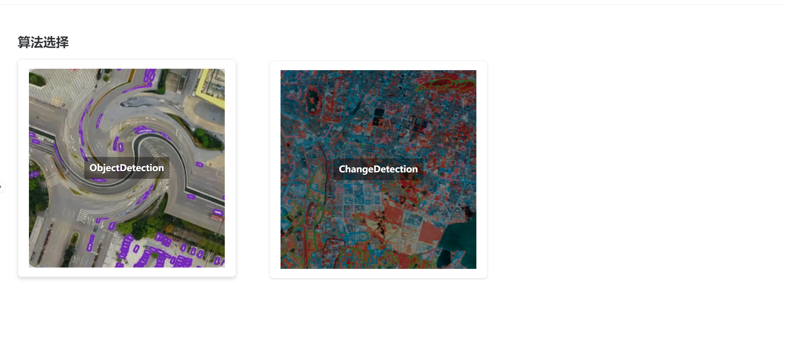
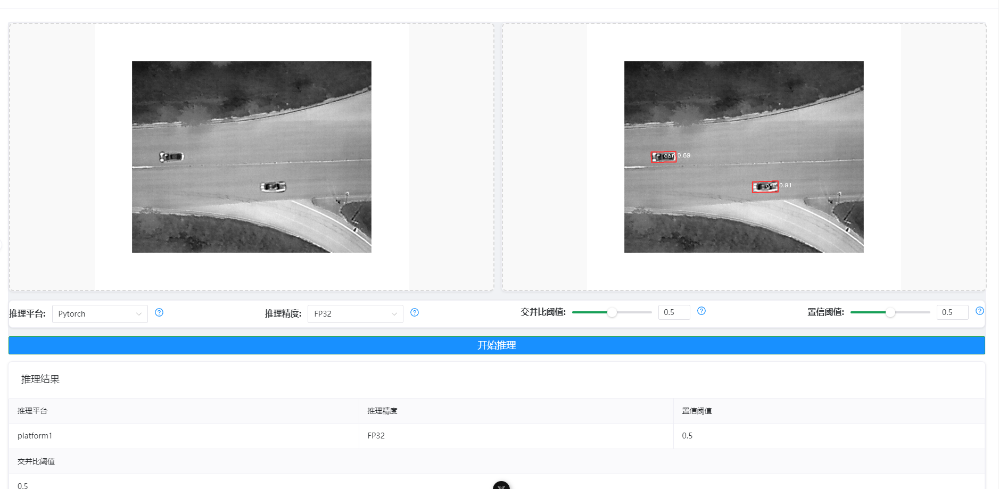

<div align="center">
  <div style="display: flex; align-items: center; justify-content: center;">
    
    <h1>Multi-Task-Backend Inference Deployment Framework</h1>
  </div>
</div>

# Introduction
Multi-Task-Backend Inference Deployment Framework (MTBIDF) is a framework for deploying multi-task inference models on the backend.
This framework is designed to be a one-stop solution for multi-task inference deployment, including model inference, quantization, and frontend deployment. 
# Features
- Support for multiple tasks, including object detection, Segmentation, and classification.
- Support for multiple platforms, including Ascend, TensorRT, and OpenVINO.
- Support for multiple precisions, including FP32, FP16, and INT8.
- Support auto quantization and calibration.
- Support multi edge device fast deployment.

# Installation
  Docker Image: ``` docker pull **** ```

  Pip Requirements: ``` pip install -r requirements.txt ```
# Usage
## Inference Deployment
  config setting: For Inference Deployment, you need to set the config file in the config folder. For example, if you want to deploy the rotation detection model, you need to set the config file in the config/obb_det.yaml.

  ```yaml
  # 模型配置
model_dir: backend/weights/obb_det
model_name: "best_ckpt"
model_path: ""
platform: "Pytorch"
precision: "FP32"
img_size: 800
stride: 32
conf_thres: 0.25
iou_thres: 0.45
names: []
classes: None
multi_label: True
max_det: 300
agnostic: False
agnostic: false  # 假设这是 'agnos' 的完整拼写
names: ["car", "feright car", "truck", "bus", "van"]
  ```
Model Intialization only need recieve the config file. 
```python
infer_model = ObjectDetection(config)
```
How to inference a image, you can use the following code:
```python
input_path = r"your image path"
img = cv2.imread(input_path)
output = infer_model.run(img)
```
We have made unit test for the following inference framework include TensorRT, Ascend, OnnxRuntime, and Pytorch. You can adjust the model path and the framwork will automatically choose the best inference framework.

## Quantization
config setting: For Quantization, you need to set the config file in the config/quant folder. The current quantization framework support Ascend and TensorRT. For example:
```yaml
paths:
  tmp_base: "tmp/Ascend"

  model_output: "weights/OD"
calibration:
  task_type: "detection"
  batch_size: 1
  batch_num: 20
  calib_img_dir: "data/calibration/"
  model_path: "weights/OD/best_ckpt.onnx"
  platform: "Ascend"
  precision: "INT8"
  qat: false
  input_size:
    width: 800
    height: 800
  skip_layers: []
  nuq_config: null
atc:
  soc_version: "Ascend310B4"
  framework: 5
  output_name: "yolov6_quant.om"
```
You can use the following code to quantize the model:
```shell
python quant/Ascend_quant.py --config_path config/quant/obb_calibration.yaml --verbose
```
for calibration process, you can register your own process function in the quant/preprocess.py.

# Inference Fronted


dashboard page

Inference page
We has made a simple frontend for the inference deployment framework. You can use the following code to run the frontend:

```shell
npm run dev

```

# Roadmap
- [x] Support for Segmentation. 20250114 Fix TensorRT <=10.0 Context bug error
- [ ] Support Docker Image make.
- [ ] Support FastAPI backend inference Service.
- [ ] Support k8s deployment.
- [ ] Support Vue3 frontend.
